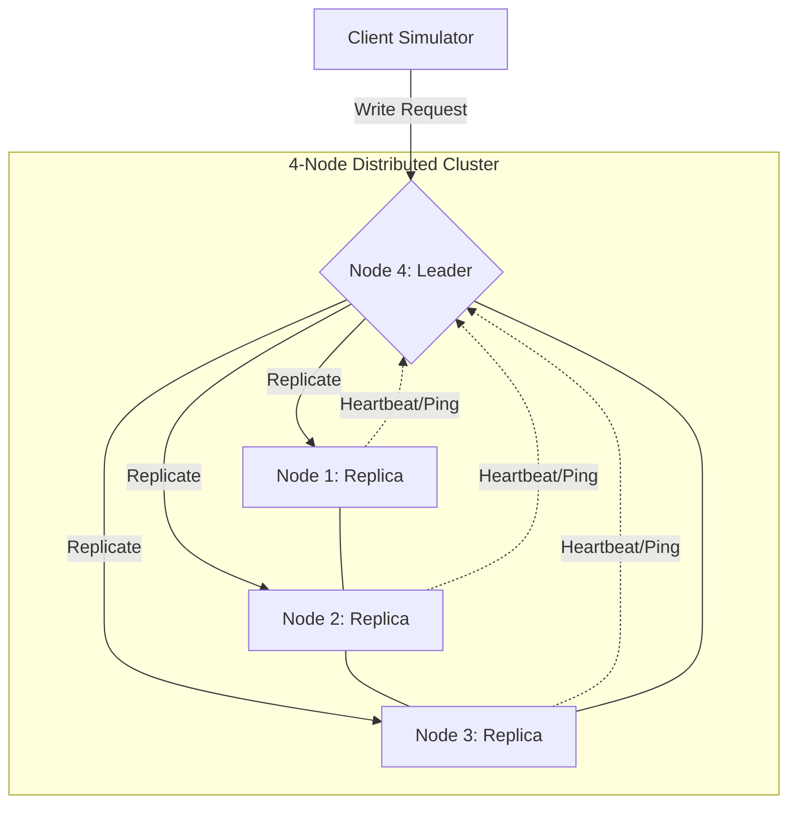

# Comprehensive Case Study Report: Amazon Aurora Distributed Architecture Simulation

**Course:** Distributed Systems (Case Study Evaluation)
**Target System:** Amazon Aurora (Simulated Cluster)
**Team Members:** 3 Members (Managing 4-Node Cluster)

---

## 1. Problem Understanding & Relevance (Rubric 1 - 10 Marks)
**Amazon Aurora** addresses the "Monolithic Constraint" of traditional databases where compute and storage are tied together. In distributed systems, this is a "Single Point of Failure" and a scalability bottleneck.

**Relevance:** 
This simulation models **Service-Oriented Architecture (SOA)** and **Resource Decoupling**. By separating the "Leader" (Compute) from "Replicas" (Storage), we demonstrate how a distributed system maintains Availability even when the network is partitioned or a node crashes.

---

## 2. Architecture Design & Algorithms (Rubric 2 - 10 Marks)

### Visual Architecture Diagram


### Algorithm Selection
1.  **Bully Election Algorithm (Unit 2: Election Algorithms)**
    *   **Goal:** To ensure the cluster always has one primary coordinator.
    *   **Logic:** When the Leader fails, the node with the highest ID (e.g., Node 3) declares itself the new leader by "bullying" lower-ID nodes.
2.  **Quorum-Based Voting Protocol (Unit 3: Consistency & Replication)**
    *   **Goal:** To ensure data consistency across multiple systems.
    *   **Logic:** A write only succeeds if a majority (Quorum) of nodes (e.g., 3 out of 4) successfully store the data.

---

## 3. Implementation Details (Rubric 3 - 10 Marks)

The system is implemented using **Python Socket Programming** to simulate real-world networking across 4 systems.

*   **node.py**: Handles multi-threaded communication, state management for storage, and the election state machine.
*   **client.py**: Implements leader-discovery and provides a CLI for user interaction.
*   **cluster_config.json**: A decentralized configuration file that stores the IP/Port mappings for all nodes in the local network.

---

## 4. Output & Testing Scenarios (Rubric 4 - 10 Marks)

### Expected Terminal Logs (Success Case)
When running a `write` command, you will see:
```text
[WRITE] Client write request received: user=amrita
[QUORUM] Replicating to Node 1... ACK received.
[QUORUM] Replicating to Node 2... ACK received.
[QUORUM] Replicating to Node 3... ACK received.
[QUORUM] Write SUCCESS! Quorum achieved (4/4 ACKs)
```

### Expected Terminal Logs (Failure Case)
When Node 4 (Leader) is killed:
```text
[FAILURE] Leader Node 4 did not respond! Assuming failed.
[ELECTION] Node 3 starting election (Bully Algorithm)...
[ELECTION] No response from higher nodes. I am the new LEADER!
[LEADER] Node 3 is the new leader.
```

---

## 5. Individual Presentation & Q&A (Rubric 5 - 10 Marks)

To prepare for Q&A, be ready to answer:
1.  **Q: Why use 4 nodes?** A: To demonstrate Quorum. If we have 4 nodes, a majority is 3. We can lose 1 node and still function.
2.  **Q: What happens if the network is split?** A: The Bully algorithm ensures the largest partition elects a leader, maintaining "Partition Tolerance" (CAP Theorem).
3.  **Q: How does this relate to Amazon Aurora?** A: Aurora uses 6 nodes across 3 AZs. We are simulating a scaled-down version of their log-structured replication.
